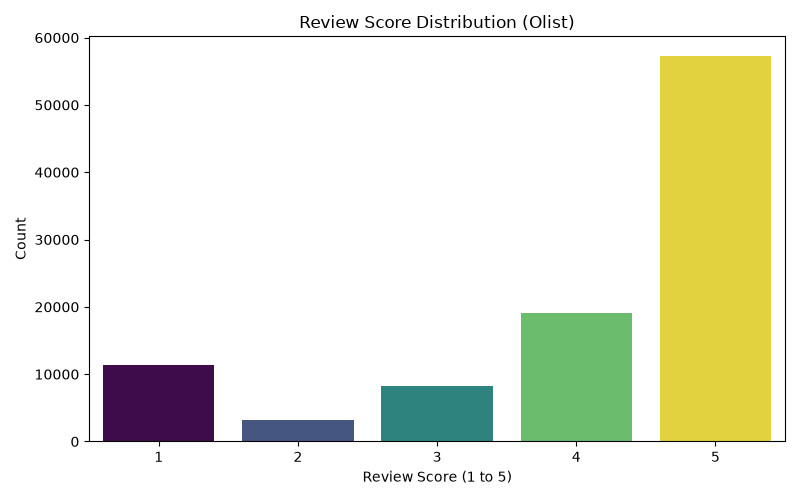
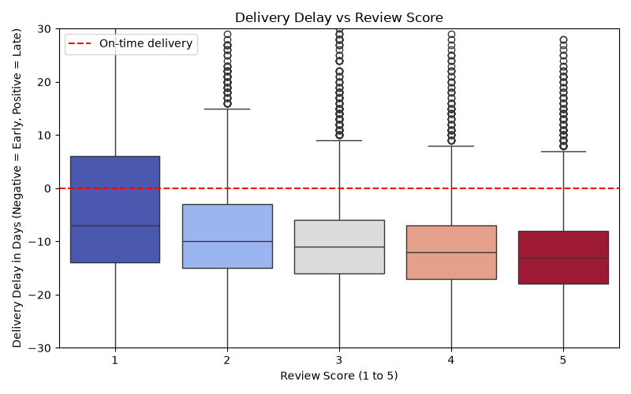
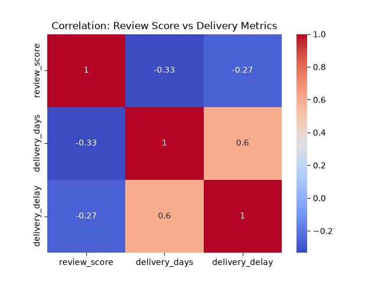

# Olist E-Commerce: Customer Satisfaction EDA

## Problem
Olist is a Brazilian online marketplace. This project explores its orders and
customer reviews to answer two questions:
1. How does delivery performance relate to customer review scores?
2. How usable is the review text for downstream NLP / AI work
   (sentiment analysis, retrieval, support automation)?

## Approach
Structured 8-step EDA: overview, univariate, bivariate, multivariate, outlier
analysis, missing-value patterns, feature hypotheses, written conclusions.
- Converted timestamp columns to datetime
- Engineered `delivery_days` (purchase to delivery) and `delivery_delay`
  (delivery minus estimated date; negative = early)
- Merged orders and reviews on `order_id`
- Analyzed who writes review text, and how that skews the data
- Verified the delay-vs-score hypothesis using % late and median (not just
  mean, which is outlier-sensitive)

## Tech Stack
Python, Pandas, Matplotlib, Seaborn

## Results

**Dataset:** 99,441 orders, 99,224 reviews (98,673 unique order_ids — 551
orders have more than one review), 99,224 rows after an inner merge on
`order_id` (no reviews were dropped).

### 1. Order status is heavily imbalanced
97.0% of orders are `delivered` (96,478 of 99,441). Any future order-status
model would reach ~97% accuracy by predicting "delivered" alone — F1/Recall
must be used, not accuracy.

### 2. Review scores are polarized
Mean 4.09, median 5 (left-skewed). 57.8% are 5-star. 1-star (11,424, 11.5%) is
more common than 2-star (3,151, 3.2%): customers mostly review at the extremes,
rarely in the middle.

### 3. Delivery estimates are conservative
Orders arrive 12.1 days after purchase on average (median 10, right-skewed,
max 209 days). They arrive 11.9 days before the *estimated* date on average
(median -12, meaning half of all orders are 12+ days early).

### 4. Delay predicts dissatisfaction — but only through % late, not the mean
Average delay by score (days, negative = early): 1★ -4.1, 2★ -8.6, 3★ -10.8,
4★ -12.4, 5★ -13.4. Taken alone this looks weak, because the mean is pulled by
outliers (delay ranges from -147 to +188 days).

The real signal is in **% of orders that were actually late** (delay > 0):

| Score | % Late | Median Delay (days) |
|---|---|---|
| 1★ | 36.6% | -7 |
| 2★ | 18.9% | -10 |
| 3★ | 8.8% | -11 |
| 4★ | 3.4% | -12 |
| 5★ | 1.9% | -13 |

This is a clean, monotonic relationship: 1-star orders are **19x more likely**
to be late than 5-star orders. Lateness is a strong, robust predictor of
dissatisfaction — the mean alone understated this because most orders (even
1-star ones) still arrive early.

`delivery_days` and `delivery_delay` correlate at 0.60 with each other (as
expected, since delay is derived from actual delivery time) — both correlate
with `review_score` at -0.33 and -0.27 respectively. Using both together in a
model means accounting for that overlap.

**Delivery time outliers:** using the IQR method, 4,926 orders (5.1% of
delivered orders) took longer than 28.5 days to deliver.

### 5. Most reviews have no text
88.3% lack a title and 58.7% lack a comment; only 40,977 reviews (41.3%)
contain text.

### 6. Unhappy customers write more — and write longer
76.5% of 1-star reviews contain text vs 31-36% for 4-5 star. They also write
noticeably longer reviews (median 89 characters for 1★ vs 42 for 5★). The text
subset skews negative as a result: 1-2 star reviews make up 26.5% of the text
subset vs 14.7% of all reviews.

| Score | Share of all reviews | Share of text-only reviews | Median length (chars) |
|---|---|---|---|
| 1★ | 11.5% | 21.3% | 89 |
| 2★ | 3.2% | 5.2% | 88 |
| 3★ | 8.2% | 8.7% | 70 |
| 4★ | 19.3% | 14.6% | 47 |
| 5★ | 57.8% | 50.2% | 42 |

### 7. Review text is in Brazilian Portuguese
e.g. *"Ainda nao recebir meu produto..."*, *"Produto ruim pelo preço cobrado."*
English-only NLP tooling (tokenizers, stopword lists, sentiment models) will
not work out of the box.

**Hypothesis check:** delivery delay predicts review score, but only when
measured as % late / median — the mean alone was misleading due to outlier
skew. This was the most useful correction from the original hypothesis.

**Limitations:** correlation is not causation; product category and seller
effects are not yet analyzed; 551 orders with multiple reviews are currently
duplicated in the merged table and would need de-duplication (e.g. latest
review only) before order-level modeling.

## Implications for Next Steps
- **Project 2 (ML Pipeline):** predicting unhappy customers (score ≤ 2, 14.7%
  of reviews) is an imbalanced classification task. `is_late` is a stronger,
  more interpretable candidate feature than raw `delivery_delay`. Resolve the
  551 duplicate-review orders before modeling at the order level.
- **Project 3 (NLP):** needs a Portuguese-capable or multilingual model, and
  must account for the text subset's skew toward negative, longer reviews.

## How to Run
1. `pip install pandas matplotlib seaborn`
2. Download "Brazilian E-Commerce Public Dataset by Olist" from Kaggle and
   place the CSVs in `data/` (not committed to the repo — see `.gitignore`).
3. Run `eda_day46.py`, `eda_day47.py`, `eda_day48.py`, `eda_day49.py` in order.

## Live Demo
TBD (planned: published notebook/report)

## Data Source
Brazilian E-Commerce Public Dataset by Olist (Kaggle). Check the dataset page
for license and attribution requirements.

